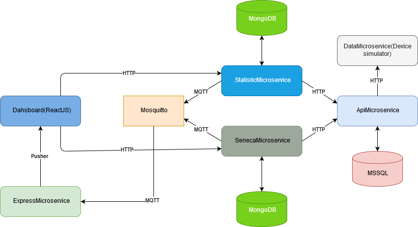

# Service-oriented architecture microservices project

This is a school project about microservices architecture in IoT.

## Technologies

Technologies used in this project:
- [ASP.NET Core](https://docs.microsoft.com/en-us/aspnet/core/?view=aspnetcore-2.2)
- [Seneca.js](http://senecajs.org/)
- [Express.js](https://expressjs.com/)
- [React](https://reactjs.org/)
- [MS SQL](https://www.microsoft.com/en-us/sql-server/sql-server-2017)
- [MongoDB](https://www.mongodb.com/)
- [Eclipse Mosquitto](https://mosquitto.org/)
- [Pusher](https://pusher.com/)
- [Docker](https://www.docker.com/)

## Pre-reqs

To build and run this app locally you will need a few things:
- Install [Docker](https://www.docker.com/)
- Install [Docker Compose](https://docs.docker.com/compose/)


## Running the project
- Clone the repository
```
git clone https://github.com/strahinja16/soa-microservices
```
- Run the project
```
docker-compose up --build
```
:warning: `MS SQL database must be migrated. MS SQL migrations are located in the ApiMicroservice project` :warning:

## Architecture



### DataMicroservice

ASP.NET Core microservice that reads data from txt file and simulates an IoT sensor. Api url for the data is `http://localhost:8001/api/data` Every data has a TTL so that multiple services that are getting the data can get the same data. It adds a Guid to the data so services that are getting the data can identify a duplicate.

### ApiMicroservice

ASP.NET Core microservice that calls the DataMicroservice to get the data. Also it stores the data in the MS SQL database and provides a REST api. Url to get stored data is `http://localhost:8000/api/<entity>`. Entity can be: wifi, address, location, application, call and bluetooth.


### SenecaMicroservice

Seneca and Express microservice that calls the ApiMicroservice, calculates some statistic information and stores it in the MongoDB database. Also it provides a REST api for the data. Url to get the data is `http://localhost:3000/api/<entity>/getAll`. Entity can be bluetooth, application and call.

### StatisticMicroservice

ASP.NET Core microservice that calls the ApiMicroservice, calculates some statistic information and stores it in the MongoDB database. Also it provides a REST api for the data. Url to get the data is `http://localhost::8002/api/<stat_entity>`. StatEntity can be wificapability, addresscount and locationaccuracy.

### DashboardMicroservice

React application that calls the SenecaMicroservice and StatisticMicroservice api to get the stored data and provides a dashboard for the data. Also it has a realtime data update when new data is published on Pusher. Dahsboard url is `http://localhost:1234`.

### ExpressMicroservice

Microservice that is subscribed to MQTT topics and when data arrives it publishes the data on Pusher.

### Mosquitto

MQTT broker.
